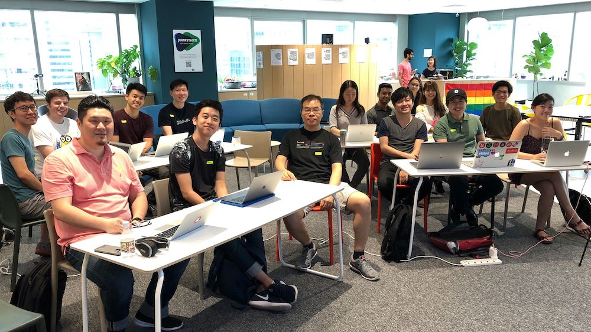

# Coding Dojo - Getting Started

This is meant to be a guide for participants involved in JuniorDevSG Coding Dojos.

Here's a [quick intro to the Coding Dojo](https://docs.google.com/presentation/d/1c7jKltjGG8nK3r7iwODpC6qbZ4MxN1Iwd_e4zxgG1NY/edit?usp=sharing).

## Code Kata Bootstrap Guide

Get started with your test environment in various programming languages.

- [C# with xUnit](./csharp_xunit.md)
- [F# with xUnit](./fsharp_xunit.md)
- [Go with Go Test](./golang_gotest.md)
- [Java with Junit, Gradle](./java_junit.md)
- [Kotlin with Kotlin Test, Gradle](./kotlin_kotlintest.md)
- [NodeJS with Jest](./nodejs_jest.md)
- [Python with pytest](./python_pytest.md)
- [Ruby with RSpec](./ruby_rspec.md)
- [Rust with Cargo Test](./rust_cargotest.md)
- [Swift](./swift.md)

## Contributors

- Gordon Song ([songguoqiang](https://github.com/songguoqiang))
- Michael Cheng ([miccheng](https://github.com/miccheng))
- Isha Tripathi ([isha-tripathi](https://github.com/isha-tripathi))
- Björn Andersson ([gaqzi](https://github.com/gaqzi))
