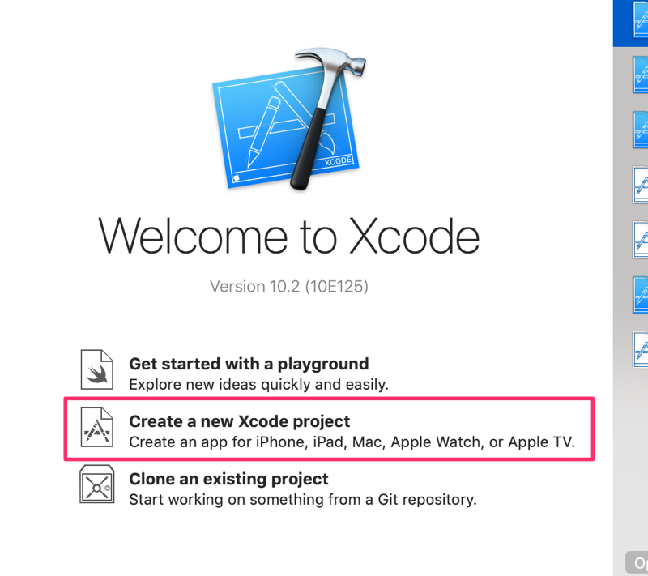

# Swift

*__Note__: This guide assumes you have the latest Xcode installed.*

1. Start a new project in Xcode

    
    
2. Select the "Cocoa Touch Framework" as the template for the new project.

    
    
3. Do add the project name / kata exercise name.

    
    
    Select Swift as the language. Select "Include Unit Tests".
    
4. Save in an appropriate folder.
5. Select a simulator.
6. Press `⌘` + `U` to execute the unit test.
7. The test should run and pass.
8. Open the first `*Test.swift` file and remove the sample test functions: `setUp`, `tearDown`, `testExample` and `testPerformanceExample`.
9. Press `⌘` + `N` to create a new file. Select `Swift File`. Click "Next". Give the file a name.
11. Make sure the file is included in the `*Tests` target.
12. You can now write new tests.